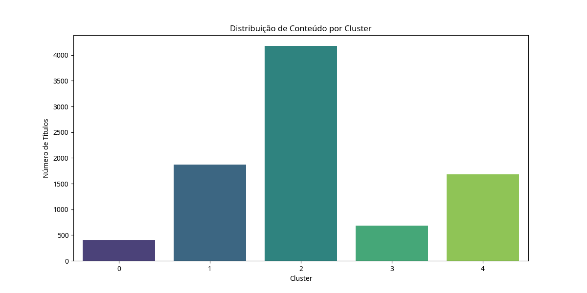

#  Análise de Dados Netflix

  

##  Visão Geral do Projeto

Este projeto visa explorar e analisar o vasto catálogo de filmes e séries da Netflix, utilizando técnicas de mineração de dados para descobrir padrões e agrupar conteúdos semelhantes. A principal técnica aplicada é o K-Means Clustering, que permite segmentar o conteúdo da plataforma com base em suas características textuais (descrição e gêneros). O objetivo final é fornecer insights sobre a estrutura do catálogo da Netflix, o que pode ser valioso para estratégias de recomendação, curadoria de conteúdo e marketing.

  

##  Dataset

  

O coração desta análise é o dataset `netflix_titles.csv`, uma compilação rica em informações sobre os títulos disponíveis na Netflix. Este dataset inclui:

  

-  `show_id`: Identificador único para cada título.

-  `type`: Categoria do conteúdo (Filme ou Série de TV).

-  `title`: Título do filme ou série.

-  `director`: Diretor(es) do título.

-  `cast`: Elenco principal do título.

-  `country`: País(es) de produção.

-  `date_added`: Data em que o título foi adicionado à Netflix.

-  `release_year`: Ano de lançamento original do título.

-  `rating`: Classificação indicativa.

-  `duration`: Duração (para filmes) ou número de temporadas (para séries).

-  `listed_in`: Gêneros e categorias associadas ao título.

-  `description`: Breve sinopse do conteúdo.

  

O dataset foi obtido do Kaggle, uma plataforma confiável para conjuntos de dados públicos, garantindo a qualidade e a integridade dos dados utilizados.

  

##  Metodologia

  

A análise foi conduzida em Python, utilizando as bibliotecas `pandas` para manipulação de dados, `scikit-learn` para a aplicação do algoritmo de clustering e `matplotlib` e `seaborn` para visualização.

  

###  Pré-processamento de Dados

  

1.  **Tratamento de Valores Nulos:** As colunas `description` e `listed_in` tiveram seus valores nulos preenchidos com strings vazias para garantir a consistência e evitar erros durante a vetorização.

2.  **Combinação de Features:** As colunas `description` e `listed_in` foram concatenadas para criar uma nova feature, `combined_features`. Esta abordagem permite que o algoritmo de clustering considere tanto a sinopse textual quanto os gêneros associados ao conteúdo, fornecendo uma representação mais completa.

  

###  Vetorização de Texto (TF-IDF)

  

Para converter os dados textuais da coluna `combined_features` em um formato numérico compreensível pelo algoritmo de clustering, foi utilizada a técnica TF-IDF (Term Frequency-Inverse Document Frequency). O `TfidfVectorizer` foi configurado para:

  

- Remover *stop words* em inglês, que são palavras comuns que não agregam valor semântico significativo.

- Limitar o número de features (termos) a 5000, reduzindo a dimensionalidade e focando nos termos mais relevantes.

  

###  K-Means Clustering

  

O algoritmo K-Means foi aplicado à matriz TF-IDF resultante. As configurações utilizadas foram:

  

-  **Número de Clusters (`n_clusters`):** Definido como 5. Esta escolha inicial foi feita para explorar uma segmentação razoável do catálogo, buscando grupos distintos e interpretáveis.

-  **Inicialização (`init`):**  `k-means++`, um método que seleciona os centroides iniciais de forma inteligente para acelerar a convergência e melhorar a qualidade dos clusters.

-  **Máximo de Iterações (`max_iter`):** 300, para garantir que o algoritmo tenha tempo suficiente para convergir.

-  **Número de Inicializações (`n_init`):** 10, para executar o algoritmo múltiplas vezes com diferentes centroides iniciais e escolher a melhor configuração, minimizando o risco de cair em mínimos locais.

-  **Estado Aleatório (`random_state`):** 42, para garantir a reprodutibilidade dos resultados, permitindo que a análise seja replicada com os mesmos agrupamentos.

  

O resultado do K-Means é a atribuição de cada título a um cluster específico, que é adicionado ao DataFrame original na coluna `cluster`.

  

##  Resultados e Visualizações

  

Após a execução do script de análise, os seguintes resultados foram gerados e visualizados:

  

###  Distribuição de Conteúdo por Cluster

  

Este gráfico mostra a contagem de títulos em cada um dos 5 clusters identificados, oferecendo uma visão da proporção de conteúdo em cada segmento.

  


  

###  Principais Termos por Cluster

  

Foram identificados os 5 termos mais representativos para cada cluster, que ajudam a caracterizar e interpretar o tipo de conteúdo predominante em cada grupo:

  

-  **Cluster 0:**  `stand`, `comedy`, `comedian`, `special`, `comic` (Conteúdo de Comédia Stand-Up)

-  **Cluster 1:**  `documentaries`, `tv`, `kids`, `documentary`, `series` (Documentários e Séries de TV, possivelmente infantis)

-  **Cluster 2:**  `movies`, `dramas`, `international`, `comedies`, `independent` (Filmes diversos, com foco em dramas, comédias e produções internacionais/independentes)

-  **Cluster 3:**  `children`, `family`, `movies`, `comedies`, `save` (Conteúdo para Crianças e Família)

-  **Cluster 4:**  `tv`, `shows`, `international`, `crime`, `dramas` (Séries de TV, com ênfase em dramas criminais e produções internacionais)

  

###  Exemplos de Títulos por Cluster

  

Para cada cluster, uma amostra de títulos foi exibida para ilustrar o tipo de conteúdo agrupado:

  

-  **Cluster 0:** ["Wanda Sykes: Not Normal", "Jeff Dunham: Minding the Monsters", "Ladies Up", "Beyond Stranger Things", "Brian Regan: Nunchucks and Flamethrowers"]

-  **Cluster 1:** ["Beyond All Boundaries", "Perfect Bid: The Contestant Who Knew Too Much", "Nazi Mega Weapons", "Mobile Suit Gundam UC", "Bread Barbershop"]

-  **Cluster 2:** ["Posesif", "A Christmas Special: Miraculous: Tales of Ladybug & Cat Noir", "Jefe", "Hisss", "I'll See You in My Dreams"]

-  **Cluster 3:** ["Pets United", "Krish Trish and Baltiboy: Part II", "Coraline", "LEGO Marvel Spider-Man: Vexed by Venom", "Cobra Kai - The Afterparty"]

-  **Cluster 4:** ["Dueños del paraíso", "The Parisian Agency: Exclusive Properties", "It's Okay to Not Be Okay", "The Snitch Cartel: Origins", "Republic of Doyle"]

  

###  Distribuição de Tipos de Conteúdo por Cluster

  

Este gráfico detalha a proporção de filmes e séries de TV dentro de cada cluster, revelando se os agrupamentos são mais específicos para um formato de conteúdo.

  
 


  

###  Top 5 Países por Cluster

  

Uma análise geográfica dos clusters, mostrando os 5 principais países de produção para cada grupo, o que pode indicar tendências regionais na criação de certos tipos de conteúdo.

  
 

  

##  Como Reproduzir a Análise

  

Para executar este projeto e reproduzir a análise, siga os passos abaixo:

  

1.  **Pré-requisitos:**

* Certifique-se de ter o Python 3.x instalado em seu sistema.

* Instale as bibliotecas necessárias utilizando `pip`:

```bash

pip install pandas scikit-learn matplotlib seaborn

```

  

2.  **Estrutura do Projeto:**

* Faça o download do dataset `netflix_titles.csv` e salve-o no mesmo diretório do script Python.

* O script principal para a análise é `analyze_netflix_data.py`.

  

3.  **Execução:**

* Abra um terminal ou prompt de comando.

* Navegue até o diretório onde os arquivos do projeto estão localizados.

* Execute o script Python:

```bash

python analyze_netflix_data.py

```


  
